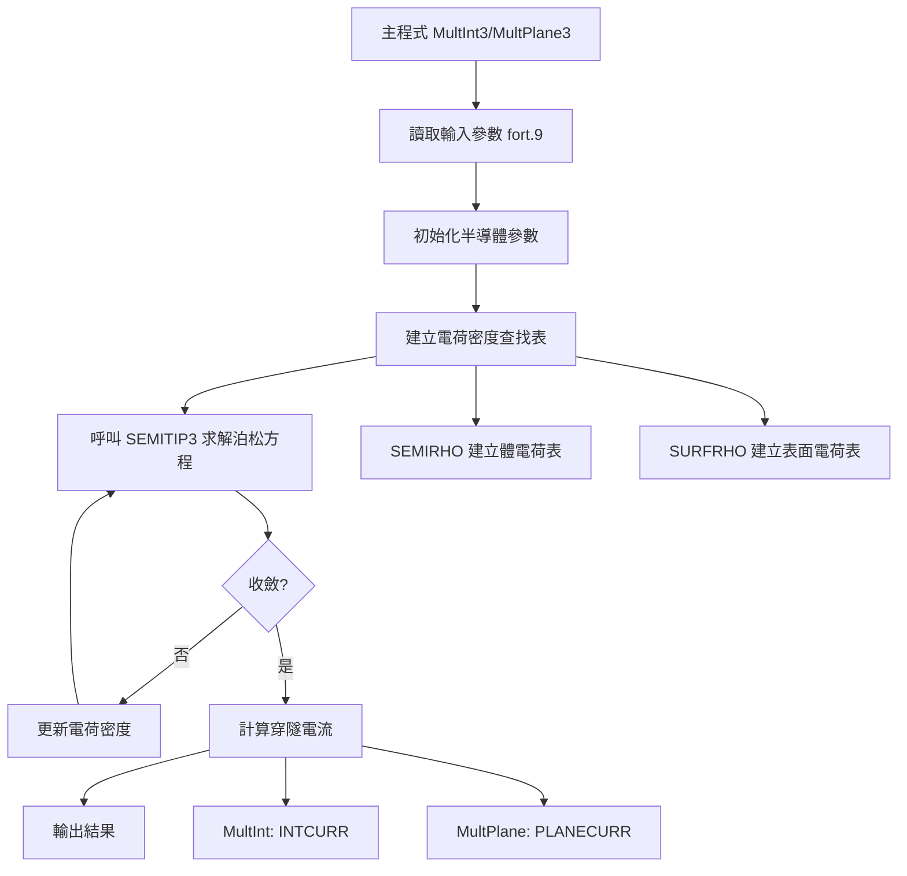
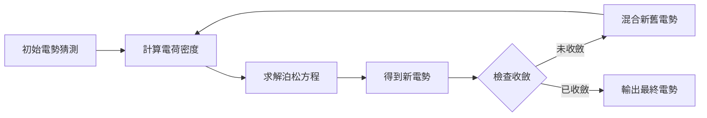
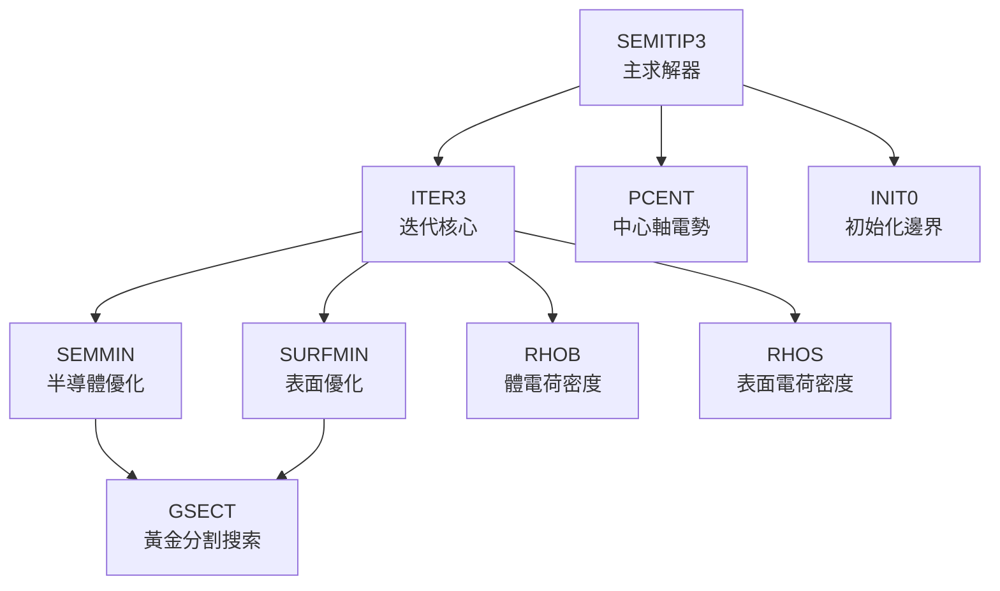
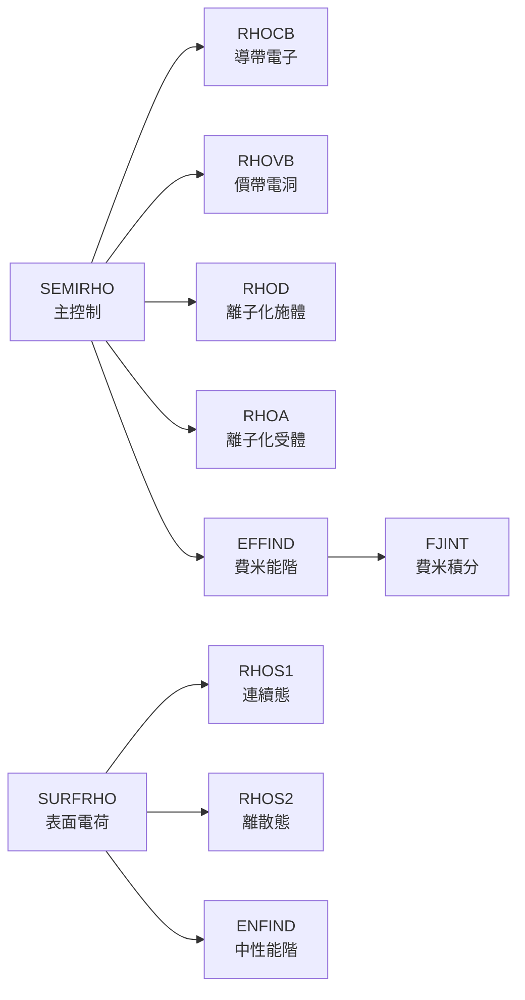
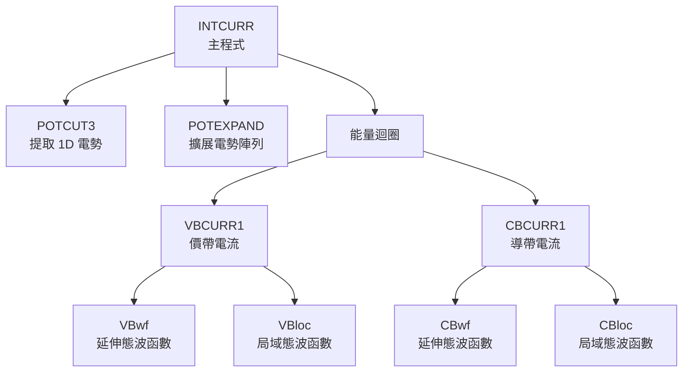
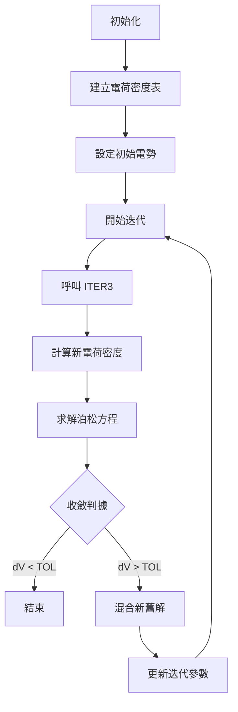
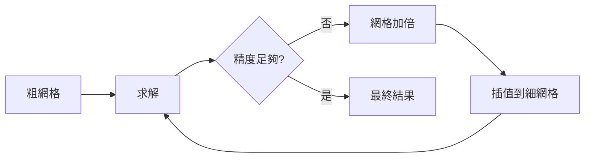

# SEMITIP Fortran 程式架構完整分析

**作者**: odindino  
**完成日期**: 2025年6月11日  
**目的**: 為 Pysemitip 專案提供完整的 Fortran 原始碼架構理解

## 目錄
1. [概述](#概述)
2. [程式版本差異](#程式版本差異)
3. [主要程式流程圖](#主要程式流程圖)
4. [COMMON Blocks 資料流](#common-blocks-資料流)
5. [核心子程式關係圖](#核心子程式關係圖)
6. [詳細子程式功能說明](#詳細子程式功能說明)
7. [變數傳遞邏輯](#變數傳遞邏輯)
8. [關鍵演算法流程](#關鍵演算法流程)

---

## 概述

SEMITIP 是一個用於模擬掃描穿隧顯微鏡（STM）的 Fortran 程式套件，由 Carnegie Mellon University 的 R.M. Feenstra 教授團隊開發。程式主要解決針尖-半導體系統的靜電場和穿隧電流計算問題。

### 核心功能
1. **3D 泊松方程求解**：計算針尖和半導體間的靜電勢分佈
2. **自洽電荷密度計算**：包含體載子和表面態
3. **穿隧電流計算**：基於 Bardeen 轉移哈密頓理論
4. **多區域半導體支援**：可處理異質結構

---

## 程式版本差異

### MultInt 版本（多維積分）
- **主程式**：`MultInt3-6.4.f`
- **特點**：使用 1D 積分近似，速度快
- **電流計算**：`intcurr-6.2.f`
- **應用**：一般 STM/STS 測量模擬

### MultPlane 版本（平面波展開）
- **主程式**：`MultPlane3-6.3.f`
- **特點**：完整 3D 量子力學計算，精度高
- **電流計算**：`planecurr3-6.1.f`
- **應用**：量子結構和週期性系統

---

## 主要程式流程圖



### 自洽迭代詳細流程



---

## COMMON Blocks 資料流

### 主要 COMMON Blocks 關係圖

```mermaid
graph TD
    SEMI[/SEMI/<br/>半導體參數] --> SEMIRHO[SEMIRHO<br/>體電荷計算]
    SEMI --> INTCURR[INTCURR<br/>電流計算]
    
    SURF[/SURF/<br/>表面態參數] --> SURFRHO[SURFRHO<br/>表面電荷計算]
    SURF --> INTCURR
    
    CD[/CD/<br/>電荷密度表] --> SEMITIP3[SEMITIP3<br/>泊松求解]
    SEMIRHO --> CD
    SURFRHO --> CD
    
    TIPPOS[/TIPPOS/<br/>針尖位置] --> SEMITIP3
    TIPPOS --> INTCURR
    
    PROTRU[/PROTRU/<br/>針尖突起] --> SEMITIP3
    PROTRU --> INTCURR
```

### 詳細 COMMON Block 定義

#### 1. `/SEMI/` - 半導體參數
```fortran
COMMON /SEMI/ EPSIL,EGAP,DELVB,EPHOT,ACB,AVB,CD,CA,EVIS,ECON
```
- `EPSIL`: 介電常數
- `EGAP`: 能隙 (eV)
- `DELVB`: 價帶頂相對能量
- `EPHOT`: 光子能量
- `ACB/AVB`: 導帶/價帶有效質量
- `CD/CA`: 施體/受體濃度
- `EVIS/ECON`: 導帶/價帶不連續性

#### 2. `/SURF/` - 表面態參數
```fortran
COMMON /SURF/ SDENS1,EN01,FWHM1,SDENSA1,ENA1,SDENS2,EN02,FWHM2,SDENSA2,ENA2,SDENS3,EN03,FWHM3,SDENSA3,ENA3,NAREAS
```
- `SDENSi`: 表面態密度
- `EN0i`: 中性能級
- `FWHMi`: 分佈寬度
- `SDENSAi/ENAi`: 離散態參數
- `NAREAS`: 表面區域數

#### 3. `/CD/` - 電荷密度查找表
```fortran
COMMON /CD/ IER,ICB,CD0,VCD,RHOD
```
- `IER`: 誤差標誌
- `ICB`: 導帶標誌
- `CD0/VCD`: 查找表參數
- `RHOD`: 電荷密度陣列

#### 4. `/TIPPOS/` - 針尖位置（MultInt 專用）
```fortran
COMMON /TIPPOS/ TIPR,TIPZ,SEP,RAD,THETA,RADNM,RTIP
```
- `TIPR/TIPZ`: 針尖徑向/軸向位置
- `SEP`: 針尖-樣品間距
- `RAD`: 針尖半徑
- `THETA`: 針尖錐角

#### 5. `/PROTRU/` - 針尖突起
```fortran
COMMON /PROTRU/ RADPROTRU
```
- `RADPROTRU`: 突起半徑

---

## 核心子程式關係圖

### SEMITIP3 求解器內部結構



### 電荷密度計算模組



### 穿隧電流計算（MultInt 版本）



---

## 詳細子程式功能說明

### 核心求解器

#### SEMITIP3
- **功能**：3D 泊松方程求解器
- **輸入**：幾何參數、邊界條件、網格設定
- **輸出**：3D 電勢陣列 (VAC, SEM, VSINT)
- **方法**：有限差分 + SOR 迭代

#### ITER3
- **功能**：執行一次完整迭代
- **特點**：
  - 先更新半導體內部
  - 再更新真空區域
  - 最後處理表面

### 電荷密度計算

#### RHOCB (導帶電子密度)
```fortran
RHOCB = C*SQRT((ACB*TK)**3)*FJINT(1,(EF-EGAP-DELVB-POT)/TK)
```
- 使用費米-狄拉克統計
- C = 6.815E21 eV^(-1.5) cm^(-3)

#### RHOVB (價帶電洞密度)
- 考慮輕電洞、重電洞和分裂帶
- 各有不同有效質量

#### RHOD/RHOA (離子化摻雜)
- 簡併情況：完全離子化
- 非簡併：使用費米函數

### 表面態計算

#### RHOS1 (連續表面態)
- 高斯分佈：`exp(-(E-EN0)²/(2σ²))`
- 積分得到總電荷

#### RHOS2 (離散表面態)
- delta 函數分佈
- 直接計算佔據

### 穿隧電流計算

#### INTCURR 主要步驟
1. **幾何設定**：確定積分路徑
2. **電勢準備**：提取並擴展 1D 電勢
3. **能量積分**：
   ```fortran
   DO IE=1,NE
      ENER = EMAX - (IE-0.5)*DELE
      ! 計算各能帶貢獻
   END DO
   ```
4. **波函數計算**：WKB 或數值積分
5. **電流累加**：考慮費米函數差

---

## 變數傳遞邏輯

### 輸入參數流


### 關鍵變數傳遞路徑

1. **半導體參數**：
   - fort.9 → MAIN → /SEMI/ → SEMIRHO/INTCURR

2. **幾何參數**：
   - fort.9 → MAIN → /TIPPOS/ → SEMITIP3/INTCURR

3. **電荷密度表**：
   - SEMIRHO/SURFRHO → /CD/ → SEMITIP3

4. **電勢陣列**：
   - SEMITIP3 → VAC/SEM/VSINT → INTCURR

### 陣列維度傳遞

```fortran
! 主程式定義
PARAMETER (NRDIM=500, NZDIM=500)
DIMENSION VAC(0:NRDIM,0:NZDIM)

! 子程式接收
SUBROUTINE SEMITIP3(VAC,NR,NZ,...)
DIMENSION VAC(0:NR,0:NZ)
```

---

## 關鍵演算法流程

### 1. 自洽場迭代演算法



### 2. GSECT 黃金分割搜索

```fortran
! 演算法核心
TAU = 0.381966  ! 黃金分割比例
DO WHILE (ABS(X3-X0) > TOL)
    IF (F1 < F2) THEN
        ! 更新搜索區間 [X0, X2]
    ELSE
        ! 更新搜索區間 [X1, X3]
    END IF
END DO
```

用途：
- SEMMIN：找最佳半導體電勢更新
- SURFMIN：找最佳表面電勢更新

### 3. 網格加密策略



特點：
- 動態調整網格密度
- 關鍵區域（表面附近）自動加密
- 節省計算資源

### 4. 電流積分演算法

```fortran
! 能量積分
CURR = 0.0
DO IE = 1, NE
    ENER = EMAX - (IE-0.5)*DELE
    
    ! 費米函數差
    FFAC = FERMI(ENER,EFTIP) - FERMI(ENER,EFSAMP)
    
    ! 波函數計算
    CALL WAVEFUNCTION(ENER, PSI)
    
    ! 穿隧矩陣元
    TMAT = TUNNEL_MATRIX(PSI)
    
    ! 累加電流
    CURR = CURR + TMAT * FFAC * DELE
END DO
```

---

## 程式優化技巧

### 1. 查找表方法
- 預計算電荷密度 vs 電勢
- 避免重複費米積分計算
- 大幅提升迭代速度

### 2. 對稱性利用
- 柱對稱系統：只需 2D 計算
- 減少記憶體需求

### 3. 自適應精度
- 遠場：粗網格
- 近場：細網格
- 平衡精度與效率

---

## 與 Python 實現的對應建議

### 模組對應關係

| Fortran 檔案 | Python 模組 | 狀態 |
|-------------|------------|------|
| semitip3-6.1.f | physics/poisson.py | 已完成 |
| semirhomult-6.0.f | physics/charge_density.py | 已完成 |
| intcurr-6.2.f | physics/tunneling_current.py | 已完成 |
| gsect-6.0.f | utils/numerical.py | 已完成 |
| MultInt3-6.4.f | 待整合主程式 | 待開發 |

### 資料結構建議

```python
# Python 實現 COMMON blocks
class SemiconductorParams:
    """對應 /SEMI/"""
    def __init__(self):
        self.epsilon = None  # 介電常數
        self.band_gap = None  # 能隙
        # ...

class ChargeTable:
    """對應 /CD/"""
    def __init__(self):
        self.potential_grid = None
        self.charge_grid = None
        # ...
```

### 關鍵差異處理

1. **陣列索引**：Fortran 從 1 開始，Python 從 0 開始
2. **COMMON blocks**：使用類別或全域字典
3. **GOTO 語句**：重構為結構化流程
4. **隱式型別**：明確宣告所有變數型別

---

## 總結

SEMITIP Fortran 程式展現了一個成熟的科學計算架構，具有：

1. **模組化設計**：各功能獨立但協調運作
2. **數值穩定性**：多重收斂保證機制
3. **計算效率**：查找表和自適應網格
4. **物理準確性**：嚴格遵循量子力學原理

理解這個架構對於成功的 Python 移植至關重要，必須保持相同的物理模型和數值精度，同時利用 Python 的現代特性提升可維護性。